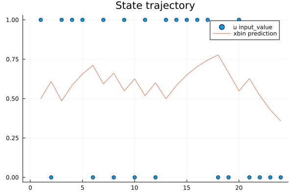
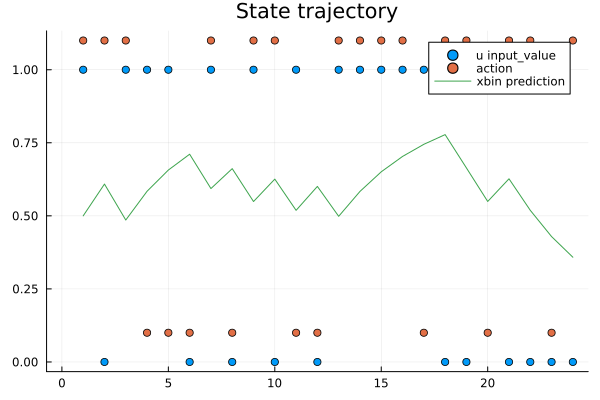
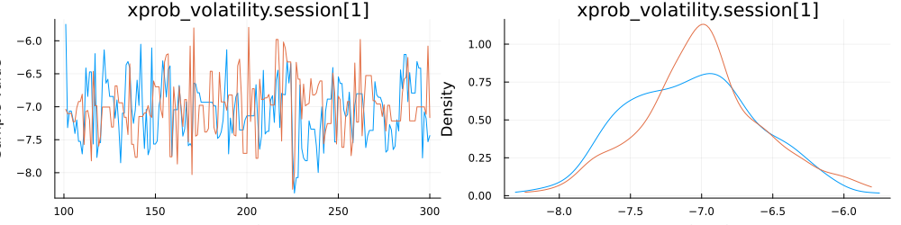

[](https://ComputationalPsychiatry.github.io/HierarchicalGaussianFiltering.jl/stable/)
[](https://computationalpsychiatry.github.io/HierarchicalGaussianFiltering.jl)
[](https://github.com/computationalpsychiatry/HierarchicalGaussianFiltering.jl/actions/workflows/CI_full.yml?query=branch%3Amain)
[](https://codecov.io/gh/computationalpsychiatry/HierarchicalGaussianFiltering.jl)
[](https://opensource.org/licenses/MIT)
[](https://github.com/JuliaTesting/Aqua.jl)

# Welcome to The Hierarchical Gaussian Filtering Package!

Hierarchical Gaussian Filtering (HGF) is a novel and adaptive package for doing cognitive and behavioral modelling. With the HGF you can fit time series data fit participant-level individual parameters, measure group differences based on model-specific parameters or use the model for any time series with underlying change in uncertainty.

NOTE: the documentation is currently under reconstruction, and is outdated. All code snippets are tested and functional, but written descriptions may not currently be accurate.

The HGF consists of a network of probabilistic nodes hierarchically structured. The hierarchy is determined by the coupling between nodes. A node (child node) in the network can inheret either its value or volatility sufficient statistics from a node higher in the hierarchy (a parent node).

The presentation of a new observation at the lower level of the hierarchy (i.e. the input node) trigger a recursuve update of the nodes belief throught the bottom-up propagation of precision-weigthed prediction error.

The HGF will be explained in more detail in the theory section of the documentation

It is also recommended to check out the ActionModels.jl pacakge for stronger intuition behind the use of agents and action models.

## Getting started

The last official release can be downloaded from Julia with "] add HierarchicalGaussianFiltering"

We provide a script for getting started with commonly used functions and use cases

Load packages

````julia
using HierarchicalGaussianFiltering
using ActionModels
````

### Create agent

````julia
action_model = ActionModel(HGFSoftmax(; HGF = "binary_3level"))
agent = init_agent(action_model, save_history = :xbin_prediction_mean)
````

````
-- ActionModels Agent --
Action model: hgf_softmax
This agent has received 0 observations

````

### Get states and parameters

````julia
get_states(agent)
````

````
(xvol_prediction_precision = 0.8807970779778823, xbin_posterior_precision = missing, xbin_prediction_precision = missing, xvol_posterior_precision = 1, xprob_value_prediction_error = missing, xprob_precision_prediction_error = missing, xprob_prediction_precision = 0.8807970779778823, xprob_effective_prediction_precision = 0.11920292202211755, xvol_effective_prediction_precision = 0.11920292202211755, xbin_prediction_mean = missing, xvol_posterior_mean = 0, xprob_posterior_precision = 1, xbin_value_prediction_error = missing, xprob_prediction_mean = 0, xprob_posterior_mean = 0, u_input_value = missing, xbin_posterior_mean = missing, xvol_precision_prediction_error = missing, xvol_value_prediction_error = missing, xvol_prediction_mean = 0)
````

````julia
get_parameters(agent)
````

````
(action_noise = 1.0, xprob_drift = 0, xvol_autoconnection_strength = 1, xvol_initial_mean = 0, xbin_xprob_coupling_strength = 1, xprob_autoconnection_strength = 1, xvol_volatility = -2, xprob_initial_precision = 1, xprob_initial_mean = 0, xvol_drift = 0, xvol_initial_precision = 1, xprob_xvol_coupling_strength = 1, xprob_volatility = -2)
````

Set a new parameter for initial precision of xprob and define some inputs

````julia
set_parameters!(agent, (; xprob_initial_precision = 0.9))
inputs = [1, 0, 1, 1, 1, 0, 1, 0, 1, 0, 1, 0, 1, 1, 1, 1, 1, 0, 0, 1, 0, 0, 0, 0];
````

### Give inputs to the agent

````julia
actions = simulate!(agent, inputs)
````

````
24-element Vector{Bool}:
 1
 1
 1
 0
 0
 0
 1
 0
 1
 1
 0
 0
 1
 1
 1
 1
 0
 1
 1
 0
 1
 1
 0
 1
````

### Plot state trajectories of input and prediction

````julia
using StatsPlots
plot(agent, ("u", "input_value"))
plot!(agent, ("xbin", "prediction"))
````


Plot state trajectory of input value, action and prediction of xbin

````julia
plot(agent, ("u", "input_value"))
plot!(actions .+ 0.1, seriestype = :scatter, label = "action")
plot!(agent, ("xbin", "prediction"))
````


### Fitting parameters

````julia
prior = (; xprob_volatility = Normal(-7, 0.5))

#Create model
model = create_model(action_model, prior, inputs, Int64.(actions), check_parameter_rejections = true)

#Fit
posterior_chains = sample_posterior!(model, n_samples = 200, n_chains = 2)
````

````
Chains MCMC chain (200×13×2 Array{Float64, 3}):

Iterations        = 101:1:300
Number of chains  = 2
Samples per chain = 200
Wall duration     = 3.0 seconds
Compute duration  = 3.0 seconds
parameters        = xprob_volatility.session[1]
internals         = lp, n_steps, is_accept, acceptance_rate, log_density, hamiltonian_energy, hamiltonian_energy_error, max_hamiltonian_energy_error, tree_depth, numerical_error, step_size, nom_step_size

Summary Statistics
                   parameters      mean       std      mcse   ess_bulk   ess_tail      rhat   ess_per_sec
                       Symbol   Float64   Float64   Float64    Float64    Float64   Float64       Float64

  xprob_volatility.session[1]   -7.0291    0.4515    0.0297   224.3017   184.8483    1.0106       74.8171

Quantiles
                   parameters      2.5%     25.0%     50.0%     75.0%     97.5%
                       Symbol   Float64   Float64   Float64   Float64   Float64

  xprob_volatility.session[1]   -7.8180   -7.3504   -7.0046   -6.7898   -6.1072

````

### Plot chains

````julia
plot(posterior_chains)
````


---

*This page was generated using [Literate.jl](https://github.com/fredrikekre/Literate.jl).*

